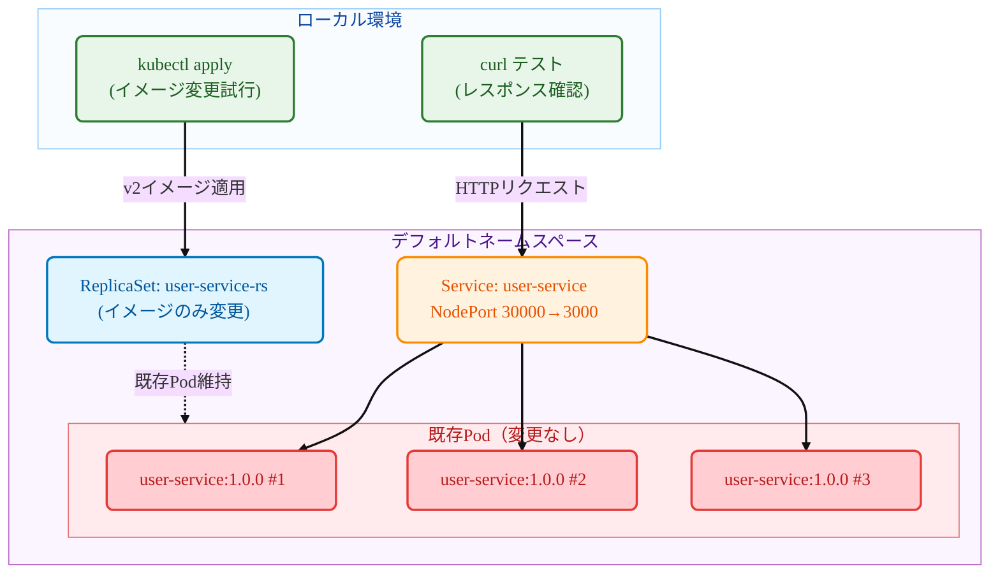

# Kubernetes ReplicaSet

## 概要 (TL;DR)

このガイドは **ReplicaSetのイメージ変更特性** を実際に体験するハンズオンチュートリアルです！

- **何を**: kubectlコマンドでReplicaSetイメージを変更し、既存Podが変更されないことを確認
- **なぜ**: ReplicaSetとDeploymentの違いを理解し、ReplicaSetがローリングアップデートをサポートしないことを直接確認するため
- **結果**: v1(user-service) → v2(payment-service)にイメージ変更後も、既存Podはuser-service:1.0.0を継続実行

> 💡 **推奨対象**: ReplicaSet vs Deploymentの違いが気になる方、ReplicaSetの制約を直接確認したい方

- **特徴**: ReplicaSetでイメージ変更時に既存Podが更新されない特性をステップ別に確認

## 1. 確認する内容

- **対象シナリオ**:



- **テスト対象**
  - **ReplicaSet** `user-service-rs`: イメージ変更試行用リソース
  - **v1 Pod**: user-service:1.0.0イメージを継続実行するPod
  - **v2イメージ**: payment-service:1.0.0に変更試行するが適用されない
  - **NodePort Service**: 既存Podへの継続的なトラフィック転送（ポート30000）

- **成功判定基準**
  - v1 ReplicaSet配備完了後、すべてのリクエストが `user-service v1.0.0` として応答
  - ReplicaSetをv2イメージに変更後も既存Podはそのまま維持
  - すべてのリクエストが依然として `user-service v1.0.0` として応答（変更なし）
  - ReplicaSetのテンプレートは変更されるが、既存Podには影響なし
  - **核心**: Deploymentとは異なり、ReplicaSetはイメージ変更時に既存Podを置き換えない

## 2. 前提条件

- OS: Linux / macOS / Windows 11 + WSL2(Ubuntu 22.04+)
- kubectl: v1.27+ (DeploymentおよびRollout対応)
- Container Runtime: Docker（推奨）またはcontainerd（+nerdctl）
- ローカルクラスタ（選択）
  - Minikube v1.33+（Dockerドライバ推奨）
  - またはkind / k3d、またはアクセス可能なK8sクラスタ
- レジストリアクセス: Docker Hubから事前ビルドイメージをpull可能
  - `mogumogusityau/user-service:1.0.0`
  - `mogumogusityau/payment-service:1.0.0`
- ネットワーク・ポート: アウトバウンドHTTPS可能、NodePort 30000使用可能
- 検証ツール: curl（レスポンス確認用）

```bash
# 必要なイメージがpull可能か確認
$ docker pull mogumogusityau/user-service:1.0.0
$ docker pull mogumogusityau/payment-service:1.0.0
```

### Minikube クラスタセットアップ

```bash
# クラスタ開始（ノード3個、CPU 2個、メモリ8GB、Cilium CNI）
$ minikube start --driver=docker --nodes=3 --cpus=2 --memory=8g --cni=cilium
😄  minikube v1.36.0 on Ubuntu 24.04
✨  Using the docker driver based on user configuration
📌  Using Docker driver with root privileges
👍  Starting "minikube" primary control-plane node in "minikube" cluster
🚜  Pulling base image v0.0.47 ...
🔥  Creating docker container (CPUs=2, Memory=8192MB) ...
🐳  Preparing Kubernetes v1.33.1 on Docker 28.1.1 ...
    ▪ Generating certificates and keys ...
    ▪ Booting up control plane ...
    ▪ Configuring RBAC rules ...
🔗  Configuring Cilium (Container Networking Interface) ...
🔎  Verifying Kubernetes components...
    ▪ Using image gcr.io/k8s-minikube/storage-provisioner:v5
🌟  Enabled addons: default-storageclass, storage-provisioner
🏄  Done! kubectl is now configured to use "minikube" cluster and "default" namespace by default

# ノード状態確認
$ kubectl get nodes -o wide
NAME           STATUS   ROLES           AGE   VERSION   INTERNAL-IP    EXTERNAL-IP   OS-IMAGE             KERNEL-VERSION     CONTAINER-RUNTIME
minikube       Ready    control-plane   68s   v1.33.1   192.168.49.2   <none>        Ubuntu 22.04.5 LTS   6.8.0-79-generic   docker://28.1.1
minikube-m02   Ready    <none>          52s   v1.33.1   192.168.49.3   <none>        Ubuntu 22.04.5 LTS   6.8.0-79-generic   docker://28.1.1
minikube-m03   Ready    <none>          40s   v1.33.1   192.168.49.4   <none>        Ubuntu 22.04.5 LTS   6.8.0-79-generic   docker://28.1.1
```

## 3. 実行手順

### ステップ別実行

```bash
# 1. namespace作成
$ kubectl apply -f k8s/overlays/dev/namespace.yaml
namespace/app-dev created

# 2. v1 ReplicaSet配備
$ kubectl apply -f k8s/base/deployment-v1.yaml
replicaset.apps/user-service-rs created

# 3. サービス作成（NodePort）
$ kubectl apply -f k8s/base/service-nodeport.yaml
service/user-service created

# 4. ConfigMap作成
$ kubectl apply -f k8s/base/configmap.yaml
configmap/user-service-config created

# 5. ReplicaSet状態確認
$ kubectl get -n app-dev replicaset
NAME              DESIRED   CURRENT   READY   AGE
user-service-rs   3         3         3       30s

# 6. Pod確認（イメージバージョンに注目）
$ kubectl get -n app-dev pods -o wide
NAME                    READY   STATUS    RESTARTS   AGE     IP             NODE           NOMINATED NODE   READINESS GATES
user-service-rs-kxhjp   1/1     Running   0          4m49s   10.244.2.206   minikube-m02   <none>           <none>
user-service-rs-szzft   1/1     Running   0          4m49s   10.244.0.230   minikube-m03   <none>           <none>
user-service-rs-txtzk   1/1     Running   0          4m49s   10.244.1.55    minikube       <none>           <none>

# 7. Pod詳細情報で現在のイメージ確認
$ kubectl -n app-dev describe pods | grep Image:
    Image:          mogumogusityau/user-service:1.0.0
    Image:          mogumogusityau/user-service:1.0.0
    Image:          mogumogusityau/user-service:1.0.0

# 8. v1サービステスト
$ curl -s http://$(minikube ip):30000/ | jq
{
  "service": "user-service",
  "version": "1.0.0",
  "message": "Hello from User Service!"
}

# 9. ★ 核心テスト：v2イメージへの変更試行
$ kubectl apply -f k8s/base/deployment-v2.yaml
replicaset.apps/user-service-rs configured

# 10. ReplicaSet確認（メタデータは更新済み）
$ kubectl -n app-dev get rs user-service-rs \
  -L app.kubernetes.io/name,app.kubernetes.io/version

# 11. ★ 重要：既存Podがそのまま残っているか確認
$ kubectl -n app-dev get pods
NAME                    READY   STATUS    RESTARTS   AGE
user-service-rs-abc12   1/1     Running   0          5m
user-service-rs-def34   1/1     Running   0          5m
user-service-rs-ghi56   1/1     Running   0          5m

# 12. ★ 核心確認：Podのイメージが依然としてuser-service:1.0.0であることを確認
$ kubectl -n app-dev describe pods | grep Image:
    Image:         mogumogusityau/user-service:1.0.0
    Image:         mogumogusityau/user-service:1.0.0
    Image:         mogumogusityau/user-service:1.0.0

# 13. サービス応答も依然としてv1であることを確認
$ curl -s http://$(minikube ip):30000/ | jq
{
  "service": "user-service",
  "version": "1.0.0",
  "message": "Hello from User Service!"
}

# 14. 整理
$ kubectl delete -f k8s/base/
```

### 核心観察ポイント
- **ReplicaSet テンプレート**: v2イメージに変更済み
- **既存Pod**: そのままuser-service:1.0.0維持
- **新しいPod生成時**: v2イメージ使用（既存Pod削除後）

## 4. 核心概念要約

- **必須ポイント**:
  - **ReplicaSet**: Pod複製本を管理する基本コントローラー（Deploymentのサブリソース）
  - **イメージ変更特性**: ReplicaSetはテンプレートのみ更新し、既存Podはそのまま維持
  - **Pod生命周期**: 既存Podが削除される時のみ新しいイメージでPod生成
  - **Deployment vs ReplicaSet**: Deploymentはローリングアップデート対応、ReplicaSetは非対応
  - **NodePort**: クラスタ外部からアクセス可能なサービスタイプ

| 区分 | ReplicaSet | Deployment |
|------|------------|------------|
| **イメージ変更時** | 既存Pod維持 | ローリングアップデートで段階的置き換え |
| **アップデート戦略** | なし | RollingUpdate、Recreate対応 |
| **ロールバック機能** | なし | `kubectl rollout undo` 対応 |
| **使用目的** | 基本Pod複製本管理 | プロダクション配備および更新 |
| **推奨使用法** | 直接使用非推奨 | プロダクション環境推奨 |

## 5. マニフェスト構造

### 5.1 ReplicaSet ファイル

```yaml
# k8s/base/deployment-v1.yaml
# 目的: user-service:1.0.0を使用した初期ReplicaSet
apiVersion: apps/v1
kind: ReplicaSet
metadata:
  namespace: app-dev
  name: user-service-rs
  labels:
    app.kubernetes.io/name: user-service
    app.kubernetes.io/version: "1.0.0"
spec:
  replicas: 3
  selector:
    matchLabels:
      app.kubernetes.io/name: user-service
  template:
    metadata:
      labels:
        app.kubernetes.io/name: user-service
        app.kubernetes.io/version: "1.0.0"
    spec:
      containers:
        - name: app
          image: mogumogusityau/user-service:1.0.0
          imagePullPolicy: IfNotPresent
          ports:
            - containerPort: 3000
          env:
            - name: PORT
              valueFrom:
                configMapKeyRef:
                  name: user-service-config
                  key: PORT
            - name: VERSION
              value: "1.0.0"
```

```yaml
# k8s/base/deployment-v2.yaml  
# 目的: payment-service:1.0.0にイメージ変更試行（適用されない）
apiVersion: apps/v1
kind: ReplicaSet
metadata:
  namespace: app-dev
  name: user-service-rs  # 変更試行のため同じ名前
  labels:
    app.kubernetes.io/name: user-service
    app.kubernetes.io/version: "2.0.0"
spec:
  replicas: 3
  selector:
    matchLabels:
      app.kubernetes.io/name: user-service
  template:
    metadata:
      labels:
        app.kubernetes.io/name: user-service
        app.kubernetes.io/version: "2.0.0"
    spec:
      containers:
        - name: app
          image: mogumogusityau/payment-service:1.0.0  # 別のサービスに変更試行
          imagePullPolicy: IfNotPresent
          ports:
            - containerPort: 3000
          env:
            - name: PORT
              valueFrom:
                configMapKeyRef:
                  name: user-service-config
                  key: PORT
            - name: VERSION
              value: "2.0.0"
            - name: MESSAGE
              value: "Hello from Payment Service!"
```

```yaml
# k8s/base/service-nodeport.yaml
# 目的: 外部アクセス用NodePortサービス
apiVersion: v1
kind: Service
metadata:
  name: user-service
  labels:
    app.kubernetes.io/name: user-service
spec:
  type: NodePort
  ports:
    - port: 3000
      targetPort: 3000
      nodePort: 30000
      protocol: TCP
      name: http
  selector:
    app.kubernetes.io/name: user-service
```

### 5.2 追加テスト: Pod手動削除

```bash
# 既存Pod一つ削除して新しいPod生成確認
$ kubectl delete pod user-service-rs-abc12
pod "user-service-rs-abc12" deleted

# 新しく生成されたPodはv2イメージ使用
$ kubectl get pods
NAME                    READY   STATUS    RESTARTS   AGE
user-service-rs-xyz89   1/1     Running   0          10s  # 新Pod: v2イメージ
user-service-rs-def34   1/1     Running   0          5m   # 既存Pod: v1イメージ
user-service-rs-ghi56   1/1     Running   0          5m   # 既存Pod: v1イメージ

# 新PodイメージPod確認
$ kubectl describe pod user-service-rs-xyz89 | grep Image:
    Image:         mogumogusityau/payment-service:1.0.0  # v2イメージ！
```

## 6. 整理

```bash
# 全リソース削除
$ kubectl delete -f k8s/base/
replicaset.apps "user-service-rs" deleted
service "user-service" deleted
configmap "user-service-config" deleted

# 整理確認
$ kubectl get all
No resources found in default namespace.
```

## 7. まとめ

このガイドを通じて **ReplicaSetのイメージ変更特性** を直接確認しました:

* **テンプレート変更**: ReplicaSetテンプレートは新しいイメージで更新
* **既存Pod保持**: イメージ変更しても既存Podはそのまま維持  
* **新Pod生成時**: Pod削除後再生成される時のみ新イメージ使用
* **Deploymentとの違い**: Deploymentはローリングアップデートで自動置き換え、ReplicaSetは手動置き換え必要

**核心学習ポイント**:
- ReplicaSetはPodテンプレート変更時に既存Podを自動更新しない
- イメージ変更が適用されるためには既存Podを手動削除する必要がある
- プロダクション環境でDeployment使用が推奨される理由を実感
- ReplicaSetの限界を理解し適切なコントローラー選択の重要性認識

この特性のため、実際のプロダクション環境ではReplicaSetを直接使用するよりもDeploymentを通じた管理が推奨されます。