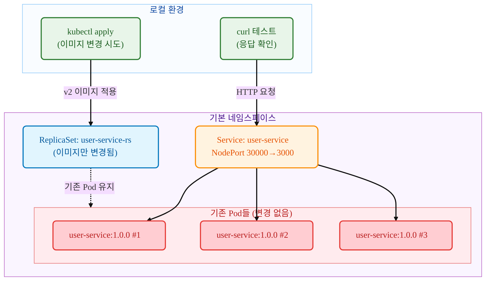

# Kubernetes ReplicaSet

## 요약 (TL;DR)

이 가이드는 **ReplicaSet의 이미지 변경 특성**을 실제로 체험해보는 실습서입니다!

- **무엇을**: kubectl 명령어로 ReplicaSet의 이미지를 변경하고, 기존 Pod들이 그대로 유지되는 것을 확인하기
- **왜**: ReplicaSet과 Deployment의 차이점을 이해하고, ReplicaSet이 롤링 업데이트를 지원하지 않는 특성을 직접 확인하기 위해
- **결과**: v1(user-service) → v2(payment-service) 이미지 변경 후에도 기존 Pod들은 그대로 user-service:1.0.0를 계속 실행

> 💡 **이런 분들께 추천**: ReplicaSet과 Deployment의 차이점이 궁금한 분, ReplicaSet의 한계를 직접 확인하고 싶은 분

- **핵심 특징**: ReplicaSet 이미지 변경 시 기존 Pod들이 업데이트되지 않는 특성을 단계별로 확인

## 1. 우리가 확인할 것 (What you'll verify)

- **목표 시나리오**:



- **테스트할 것들**
  - **ReplicaSet** `user-service-rs`: 이미지 변경 시도용 리소스
  - **v1 Pod들**: user-service:1.0.0 이미지를 계속 실행하는 Pod들
  - **v2 이미지**: payment-service:1.0.0로 변경 시도하지만 적용 안됨
  - **NodePort Service**: 기존 Pod들에 계속 트래픽 전달 (포트 30000)

- **성공 판정 기준**
  - v1 ReplicaSet 배포 완료 후 모든 요청이 `user-service v1.0.0`으로 응답
  - v2 이미지로 ReplicaSet 변경 후에도 기존 Pod들은 그대로 유지
  - 모든 요청이 여전히 `user-service v1.0.0`으로 응답 (변경 안됨)
  - ReplicaSet의 템플릿은 변경되지만 기존 Pod들은 영향 없음
  - **핵심**: Deployment와 달리 ReplicaSet은 이미지 변경 시 기존 Pod를 교체하지 않음

## 2. 준비물 (Prereqs)

- OS: Linux / macOS / Windows 11 + WSL2(Ubuntu 22.04+)
- kubectl: v1.27+ (Deployment 및 rollout 지원)
- 컨테이너 런타임: Docker(권장) 또는 containerd(+nerdctl)
- 로컬 클러스터(택1)
  - Minikube v1.33+ (Docker driver 권장)
  - 또는 kind / k3d, 또는 이미 접근 가능한 K8s 클러스터
- 레지스트리 접근: Docker Hub에서 사전 빌드된 이미지 pull 가능
  - `mogumogusityau/user-service:1.0.0`
  - `mogumogusityau/payment-service:1.0.0`
- 네트워크/포트: 아웃바운드 HTTPS 가능, NodePort 30000 사용 가능
- 검증 도구: curl (응답 확인용)

```bash
# 필요한 이미지가 pull 가능한지 확인
$ docker pull mogumogusityau/user-service:1.0.0
$ docker pull mogumogusityau/payment-service:1.0.0
```

### Minikube 클러스터 설정

```bash
# 클러스터 시작 (노드 3개, CPU 2개, 메모리 8GB, Cilium CNI)
$ minikube start --driver=docker --nodes=3 --cpus=2 --memory=8g --cni=cilium
😄  minikube v1.36.0 on Ubuntu 24.04
✨  Using the docker driver based on user configuration
📌  Using Docker driver with root privileges
👍  Starting "minikube" primary control-plane node in "minikube" cluster
🚜  Pulling base image v0.0.47 ...
🔥  Creating docker container (CPUs=2, Memory=8192MB) ...
🐳  Preparing Kubernetes v1.33.1 on Docker 28.1.1 ...
    ▪ Generating certificates and keys ...
    ▪ Booting up control plane ...
    ▪ Configuring RBAC rules ...
🔗  Configuring Cilium (Container Networking Interface) ...
🔎  Verifying Kubernetes components...
    ▪ Using image gcr.io/k8s-minikube/storage-provisioner:v5
🌟  Enabled addons: default-storageclass, storage-provisioner
🏄  Done! kubectl is now configured to use "minikube" cluster and "default" namespace by default

# 노드 상태 확인
$ kubectl get nodes -o wide
NAME           STATUS   ROLES           AGE   VERSION   INTERNAL-IP    EXTERNAL-IP   OS-IMAGE             KERNEL-VERSION     CONTAINER-RUNTIME
minikube       Ready    control-plane   68s   v1.33.1   192.168.49.2   <none>        Ubuntu 22.04.5 LTS   6.8.0-79-generic   docker://28.1.1
minikube-m02   Ready    <none>          52s   v1.33.1   192.168.49.3   <none>        Ubuntu 22.04.5 LTS   6.8.0-79-generic   docker://28.1.1
minikube-m03   Ready    <none>          40s   v1.33.1   192.168.49.4   <none>        Ubuntu 22.04.5 LTS   6.8.0-79-generic   docker://28.1.1
```

## 3. 실행 방법

### 단계별 실행

```bash
# 1. namespace 생성
$ kubectl apply -f k8s/overlays/dev/namespace.yaml
namespace/app-dev created

# 2. v1 ReplicaSet 배포
$ kubectl apply -f k8s/base/deployment-v1.yaml
replicaset.apps/user-service-rs created

# 3. 서비스 생성 (NodePort)
$ kubectl apply -f k8s/base/service-nodeport.yaml
service/user-service created

# 4. ConfigMap 생성
$ kubectl apply -f k8s/base/configmap.yaml
configmap/user-service-config created

# 5. ReplicaSet 상태 확인
$ kubectl get -n app-dev replicaset
NAME              DESIRED   CURRENT   READY   AGE
user-service-rs   3         3         3       30s

# 6. Pod들 확인 (이미지 버전 주목)
$ kubectl get -n app-dev pods -o wide
NAME                    READY   STATUS    RESTARTS   AGE     IP             NODE           NOMINATED NODE   READINESS GATES
user-service-rs-kxhjp   1/1     Running   0          4m49s   10.244.2.206   minikube-m02   <none>           <none>
user-service-rs-szzft   1/1     Running   0          4m49s   10.244.0.230   minikube-m03   <none>           <none>
user-service-rs-txtzk   1/1     Running   0          4m49s   10.244.1.55    minikube       <none>           <none>

# 7. Pod 상세 정보로 현재 이미지 확인
$ kubectl -n app-dev describe pods | grep Image:
    Image:          mogumogusityau/user-service:1.0.0
    Image:          mogumogusityau/user-service:1.0.0
    Image:          mogumogusityau/user-service:1.0.0

# 8. v1 서비스 테스트
$ curl -s http://$(minikube ip):30000/ | jq
{
  "service": "user-service",
  "version": "1.0.0",
  "message": "Hello from User Service!"
}

# 9. ★ 핵심 테스트: v2 이미지로 변경 시도
$ kubectl apply -f k8s/base/deployment-v2.yaml
replicaset.apps/user-service-rs configured

# 10. ReplicaSet 확인 (메타데이터는 업데이트됨)
$ kubectl -n app-dev get rs user-service-rs \
  -L app.kubernetes.io/name,app.kubernetes.io/version

# 11. ★ 중요: 기존 Pod들 그대로 있는지 확인
$ kubectl -n app-dev get pods
NAME                    READY   STATUS    RESTARTS   AGE
user-service-rs-abc12   1/1     Running   0          5m
user-service-rs-def34   1/1     Running   0          5m
user-service-rs-ghi56   1/1     Running   0          5m

# 12. ★ 핵심 확인: Pod들의 이미지가 여전히 user-service:1.0.0인지 확인
$ kubectl -n app-dev describe pods | grep Image:
    Image:         mogumogusityau/user-service:1.0.0
    Image:         mogumogusityau/user-service:1.0.0
    Image:         mogumogusityau/user-service:1.0.0

# 13. 서비스 응답도 여전히 v1인지 확인
$ curl -s http://$(minikube ip):30000/ | jq
{
  "service": "user-service",
  "version": "1.0.0",
  "message": "Hello from User Service!"
}

# 14. 정리
$ kubectl delete -f k8s/base/
```

### 핵심 관찰 포인트
- **ReplicaSet 템플릿**: v2 이미지로 변경됨
- **기존 Pod들**: 그대로 user-service:1.0.0 유지
- **새 Pod 생성 시**: v2 이미지 사용됨 (기존 Pod 삭제 후)

## 4. 핵심 개념 요약 (Concepts)

- **꼭 알아야 할 포인트**:
  - **ReplicaSet**: Pod의 복제본을 관리하는 기본 컨트롤러 (Deployment의 하위 리소스)
  - **이미지 변경 특성**: ReplicaSet은 템플릿만 업데이트하고 기존 Pod는 그대로 유지
  - **Pod 생명주기**: 기존 Pod가 삭제되어야만 새 이미지로 Pod 생성됨
  - **Deployment vs ReplicaSet**: Deployment는 롤링 업데이트 지원, ReplicaSet은 미지원
  - **NodePort**: 클러스터 외부에서 접근 가능한 서비스 타입

| 구분 | ReplicaSet | Deployment |
|------|------------|------------|
| **이미지 변경 시** | 기존 Pod 유지 | 롤링 업데이트로 점진적 교체 |
| **업데이트 전략** | 없음 | RollingUpdate, Recreate 지원 |
| **롤백 기능** | 없음 | `kubectl rollout undo` 지원 |
| **사용 목적** | 기본 Pod 복제본 관리 | 프로덕션 배포 및 업데이트 |
| **권장 사용법** | 직접 사용 비권장 | 프로덕션 환경 권장 |

## 5. 매니페스트 구조

### 5.1 ReplicaSet 파일

```yaml
# k8s/base/deployment-v1.yaml
# 목적: user-service:1.0.0을 사용한 초기 ReplicaSet
apiVersion: apps/v1
kind: ReplicaSet
metadata:
  namespace: app-dev
  name: user-service-rs
  labels:
    app.kubernetes.io/name: user-service
    app.kubernetes.io/version: "1.0.0"
spec:
  replicas: 3
  selector:
    matchLabels:
      app.kubernetes.io/name: user-service
  template:
    metadata:
      labels:
        app.kubernetes.io/name: user-service
        app.kubernetes.io/version: "1.0.0"
    spec:
      containers:
        - name: app
          image: mogumogusityau/user-service:1.0.0
          imagePullPolicy: IfNotPresent
          ports:
            - containerPort: 3000
          env:
            - name: PORT
              valueFrom:
                configMapKeyRef:
                  name: user-service-config
                  key: PORT
            - name: VERSION
              value: "1.0.0"
```

```yaml
# k8s/base/deployment-v2.yaml  
# 목적: payment-service:1.0.0로 이미지 변경 시도 (적용 안됨)
apiVersion: apps/v1
kind: ReplicaSet
metadata:
  namespace: app-dev
  name: user-service-rs  # 동일한 이름으로 변경 시도
  labels:
    app.kubernetes.io/name: user-service
    app.kubernetes.io/version: "2.0.0"
spec:
  replicas: 3
  selector:
    matchLabels:
      app.kubernetes.io/name: user-service
  template:
    metadata:
      labels:
        app.kubernetes.io/name: user-service
        app.kubernetes.io/version: "2.0.0"
    spec:
      containers:
        - name: app
          image: mogumogusityau/payment-service:1.0.0  # 다른 서비스로 변경 시도
          imagePullPolicy: IfNotPresent
          ports:
            - containerPort: 3000
          env:
            - name: PORT
              valueFrom:
                configMapKeyRef:
                  name: user-service-config
                  key: PORT
            - name: VERSION
              value: "2.0.0"
            - name: MESSAGE
              value: "Hello from Payment Service!"
```

```yaml
# k8s/base/service-nodeport.yaml
# 목적: 외부 접근을 위한 NodePort 서비스
apiVersion: v1
kind: Service
metadata:
  name: user-service
  labels:
    app.kubernetes.io/name: user-service
spec:
  type: NodePort
  ports:
    - port: 3000
      targetPort: 3000
      nodePort: 30000
      protocol: TCP
      name: http
  selector:
    app.kubernetes.io/name: user-service
```

### 5.2 추가 테스트: Pod 수동 삭제

```bash
# 기존 Pod 하나 삭제하여 새 Pod 생성 확인
$ kubectl delete pod user-service-rs-abc12
pod "user-service-rs-abc12" deleted

# 새로 생성된 Pod는 v2 이미지 사용
$ kubectl get pods
NAME                    READY   STATUS    RESTARTS   AGE
user-service-rs-xyz89   1/1     Running   0          10s  # 새 Pod: v2 이미지
user-service-rs-def34   1/1     Running   0          5m   # 기존 Pod: v1 이미지
user-service-rs-ghi56   1/1     Running   0          5m   # 기존 Pod: v1 이미지

# 새 Pod 이미지 확인
$ kubectl describe pod user-service-rs-xyz89 | grep Image:
    Image:         mogumogusityau/payment-service:1.0.0  # v2 이미지!
```

## 6. 정리 (Cleanup)

```bash
# 모든 리소스 삭제
$ kubectl delete -f k8s/base/
replicaset.apps "user-service-rs" deleted
service "user-service" deleted
configmap "user-service-config" deleted

# 정리 확인
$ kubectl get all
No resources found in default namespace.
```

## 7. 마무리 (Conclusion)

이 가이드를 통해 **ReplicaSet의 이미지 변경 특성**을 직접 확인했습니다:

* **템플릿 변경**: ReplicaSet 템플릿은 새 이미지로 업데이트됨
* **기존 Pod 유지**: 이미지 변경해도 기존 Pod들은 그대로 유지됨  
* **새 Pod 생성 시**: Pod 삭제 후 재생성될 때만 새 이미지 사용
* **Deployment와의 차이**: Deployment는 롤링 업데이트로 자동 교체, ReplicaSet은 수동 교체 필요

**핵심 학습 포인트**:
- ReplicaSet은 Pod 템플릿 변경 시 기존 Pod를 자동으로 업데이트하지 않음
- 이미지 변경이 적용되려면 기존 Pod를 수동으로 삭제해야 함
- 프로덕션 환경에서는 Deployment 사용이 권장되는 이유를 실감
- ReplicaSet의 한계를 이해하고 적절한 컨트롤러 선택의 중요성 인식

이 특성 때문에 실제 프로덕션 환경에서는 ReplicaSet을 직접 사용하기보다는 Deployment를 통한 관리가 권장됩니다.