# Kubernetes ReplicaSet

## Summary (TL;DR)

This guide is a hands-on tutorial to experience **ReplicaSet's image change characteristics**!

- **What**: Use kubectl commands to change ReplicaSet images and verify that existing Pods remain unchanged
- **Why**: To understand the differences between ReplicaSet and Deployment, and directly confirm that ReplicaSet doesn't support rolling updates
- **Result**: Even after changing from v1(user-service) → v2(payment-service) images, existing Pods continue running user-service:1.0.0

> 💡 **Recommended for**: Those curious about ReplicaSet vs Deployment differences, wanting to directly verify ReplicaSet limitations

- **Key Feature**: Step-by-step verification that ReplicaSet doesn't update existing Pods when images are changed

## 1. What You'll Verify

- **Target Scenario**:

```mermaid
%%{init: {
  'theme': 'base',
  'themeVariables': {
    'fontFamily': 'Inter, Pretendard, sans-serif'
  }
}}%%

flowchart TB

%% ---------- Class definitions ----------
classDef boxLocal    fill:#E3F2FD,stroke:#1E88E5,color:#0D47A1,stroke-width:2px,rx:6,ry:6;
classDef boxK8s      fill:#F3E5F5,stroke:#8E24AA,color:#4A148C,stroke-width:2px,rx:6,ry:6;
classDef boxSvc      fill:#FFF3E0,stroke:#FB8C00,color:#E65100,stroke-width:2px,rx:8,ry:8;
classDef boxV1       fill:#FFCDD2,stroke:#E53935,color:#B71C1C,stroke-width:2px,rx:6,ry:6;
classDef boxRS       fill:#E1F5FE,stroke:#0277BD,color:#01579B,stroke-width:2px,rx:6,ry:6;
classDef boxTool     fill:#E8F5E9,stroke:#2E7D32,color:#1B5E20,stroke-width:2px,rx:6,ry:6;

%% Default link style (darker & thicker)
linkStyle default stroke:#111,stroke-width:2px;

%% ---------- Local ----------
subgraph Local["Local Environment"]
  direction TB
  kubectl["kubectl apply<br/>(Attempt image change)"]:::boxTool
  curl["curl test<br/>(Response verification)"]:::boxTool
end
style Local fill:#F9FCFF,stroke:#90CAF9,color:#0D47A1

%% ---------- K8s ----------
subgraph K8s["Default Namespace"]
  direction LR

  RS["ReplicaSet: user-service-rs<br/>(Only image changed)"]:::boxRS

  subgraph Pods["Existing Pods (Unchanged)"]
    direction TB
    p1["user-service:1.0.0 #1"]:::boxV1
    p2["user-service:1.0.0 #2"]:::boxV1
    p3["user-service:1.0.0 #3"]:::boxV1
  end
  style Pods fill:#FFEBEE,stroke:#E57373,color:#B71C1C

  SVC["Service: user-service<br/>NodePort 30000→3000"]:::boxSvc
end
style K8s fill:#FAF5FF,stroke:#BA68C8,color:#4A148C

%% ---------- Edges ----------
kubectl -->|Apply v2 image| RS
RS -.->|Keep existing Pods| Pods
curl -->|HTTP request| SVC
SVC --> p1
SVC --> p2  
SVC --> p3
```



- **What to Test**
  - **ReplicaSet** `user-service-rs`: Resource for attempting image changes
  - **v1 Pods**: Pods that continue running user-service:1.0.0 image
  - **v2 Image**: Attempt to change to payment-service:1.0.0 but won't be applied
  - **NodePort Service**: Continue forwarding traffic to existing Pods (port 30000)

- **Success Criteria**
  - After deploying v1 ReplicaSet, all requests respond with `user-service v1.0.0`
  - After changing ReplicaSet to v2 image, existing Pods remain unchanged
  - All requests still respond with `user-service v1.0.0` (no change)
  - ReplicaSet template changes but existing Pods are unaffected
  - **Key Point**: Unlike Deployment, ReplicaSet doesn't replace existing Pods when images change

## 2. Prerequisites

- OS: Linux / macOS / Windows 11 + WSL2(Ubuntu 22.04+)
- kubectl: v1.27+ (Deployment and rollout support)
- Container Runtime: Docker(recommended) or containerd(+nerdctl)
- Local Cluster(choose one)
  - Minikube v1.33+ (Docker driver recommended)
  - Or kind / k3d, or any accessible K8s cluster
- Registry Access: Ability to pull pre-built images from Docker Hub
  - `mogumogusityau/user-service:1.0.0`
  - `mogumogusityau/payment-service:1.0.0`
- Network/Ports: Outbound HTTPS available, NodePort 30000 usable
- Verification Tools: curl (for response verification)

```bash
# Verify required images are pullable
$ docker pull mogumogusityau/user-service:1.0.0
$ docker pull mogumogusityau/payment-service:1.0.0
```

### Minikube Cluster Setup

```bash
# Start cluster (3 nodes, 2 CPUs, 8GB memory, Cilium CNI)
$ minikube start --driver=docker --nodes=3 --cpus=2 --memory=8g --cni=cilium
😄  minikube v1.36.0 on Ubuntu 24.04
✨  Using the docker driver based on user configuration
📌  Using Docker driver with root privileges
👍  Starting "minikube" primary control-plane node in "minikube" cluster
🚜  Pulling base image v0.0.47 ...
🔥  Creating docker container (CPUs=2, Memory=8192MB) ...
🐳  Preparing Kubernetes v1.33.1 on Docker 28.1.1 ...
    ▪ Generating certificates and keys ...
    ▪ Booting up control plane ...
    ▪ Configuring RBAC rules ...
🔗  Configuring Cilium (Container Networking Interface) ...
🔎  Verifying Kubernetes components...
    ▪ Using image gcr.io/k8s-minikube/storage-provisioner:v5
🌟  Enabled addons: default-storageclass, storage-provisioner
🏄  Done! kubectl is now configured to use "minikube" cluster and "default" namespace by default

# Verify node status
$ kubectl get nodes -o wide
NAME           STATUS   ROLES           AGE   VERSION   INTERNAL-IP    EXTERNAL-IP   OS-IMAGE             KERNEL-VERSION     CONTAINER-RUNTIME
minikube       Ready    control-plane   68s   v1.33.1   192.168.49.2   <none>        Ubuntu 22.04.5 LTS   6.8.0-79-generic   docker://28.1.1
minikube-m02   Ready    <none>          52s   v1.33.1   192.168.49.3   <none>        Ubuntu 22.04.5 LTS   6.8.0-79-generic   docker://28.1.1
minikube-m03   Ready    <none>          40s   v1.33.1   192.168.49.4   <none>        Ubuntu 22.04.5 LTS   6.8.0-79-generic   docker://28.1.1
```

## 3. Execution Steps

### Step-by-Step Execution

```bash
# 1. Create namespace
$ kubectl apply -f k8s/overlays/dev/namespace.yaml
namespace/app-dev created

# 2. Deploy v1 ReplicaSet
$ kubectl apply -f k8s/base/deployment-v1.yaml
replicaset.apps/user-service-rs created

# 3. Create service (NodePort)
$ kubectl apply -f k8s/base/service-nodeport.yaml
service/user-service created

# 4. Create ConfigMap
$ kubectl apply -f k8s/base/configmap.yaml
configmap/user-service-config created

# 5. Check ReplicaSet status
$ kubectl get -n app-dev replicaset
NAME              DESIRED   CURRENT   READY   AGE
user-service-rs   3         3         3       30s

# 6. Check Pods (note image versions)
$ kubectl get -n app-dev pods -o wide
NAME                    READY   STATUS    RESTARTS   AGE     IP             NODE           NOMINATED NODE   READINESS GATES
user-service-rs-kxhjp   1/1     Running   0          4m49s   10.244.2.206   minikube-m02   <none>           <none>
user-service-rs-szzft   1/1     Running   0          4m49s   10.244.0.230   minikube-m03   <none>           <none>
user-service-rs-txtzk   1/1     Running   0          4m49s   10.244.1.55    minikube       <none>           <none>

# 7. Verify current images in Pod details
$ kubectl -n app-dev describe pods | grep Image:
    Image:          mogumogusityau/user-service:1.0.0
    Image:          mogumogusityau/user-service:1.0.0
    Image:          mogumogusityau/user-service:1.0.0

# 8. Test v1 service
$ curl -s http://$(minikube ip):30000/ | jq
{
  "service": "user-service",
  "version": "1.0.0",
  "message": "Hello from User Service!"
}

# 9. ★ Key Test: Attempt to change to v2 image
$ kubectl apply -f k8s/base/deployment-v2.yaml
replicaset.apps/user-service-rs configured

# 10. Check ReplicaSet (metadata updated)
$ kubectl -n app-dev get rs user-service-rs \
  -L app.kubernetes.io/name,app.kubernetes.io/version

# 11. ★ Important: Verify existing Pods remain unchanged
$ kubectl -n app-dev get pods
NAME                    READY   STATUS    RESTARTS   AGE
user-service-rs-abc12   1/1     Running   0          5m
user-service-rs-def34   1/1     Running   0          5m
user-service-rs-ghi56   1/1     Running   0          5m

# 12. ★ Key Verification: Confirm Pod images are still user-service:1.0.0
$ kubectl -n app-dev describe pods | grep Image:
    Image:         mogumogusityau/user-service:1.0.0
    Image:         mogumogusityau/user-service:1.0.0
    Image:         mogumogusityau/user-service:1.0.0

# 13. Verify service response is still v1
$ curl -s http://$(minikube ip):30000/ | jq
{
  "service": "user-service",
  "version": "1.0.0",
  "message": "Hello from User Service!"
}

# 14. Cleanup
$ kubectl delete -f k8s/base/
```

### Key Observation Points
- **ReplicaSet Template**: Changed to v2 image
- **Existing Pods**: Remain with user-service:1.0.0
- **New Pod Creation**: Uses v2 image (only after deleting existing Pods)

## 4. Core Concepts Summary

- **Essential Points**:
  - **ReplicaSet**: Basic controller managing Pod replicas (sub-resource of Deployment)
  - **Image Change Behavior**: ReplicaSet only updates template, keeps existing Pods unchanged
  - **Pod Lifecycle**: New image is used only when existing Pods are deleted
  - **Deployment vs ReplicaSet**: Deployment supports rolling updates, ReplicaSet doesn't
  - **NodePort**: Service type accessible from outside the cluster

| Aspect | ReplicaSet | Deployment |
|--------|------------|------------|
| **On Image Change** | Keep existing Pods | Progressive replacement via rolling update |
| **Update Strategy** | None | RollingUpdate, Recreate supported |
| **Rollback Feature** | None | `kubectl rollout undo` supported |
| **Use Case** | Basic Pod replica management | Production deployment and updates |
| **Recommended Usage** | Direct use not recommended | Recommended for production |

## 5. Manifest Structure

### 5.1 ReplicaSet Files

```yaml
# k8s/base/deployment-v1.yaml
# Purpose: Initial ReplicaSet using user-service:1.0.0
apiVersion: apps/v1
kind: ReplicaSet
metadata:
  namespace: app-dev
  name: user-service-rs
  labels:
    app.kubernetes.io/name: user-service
    app.kubernetes.io/version: "1.0.0"
spec:
  replicas: 3
  selector:
    matchLabels:
      app.kubernetes.io/name: user-service
  template:
    metadata:
      labels:
        app.kubernetes.io/name: user-service
        app.kubernetes.io/version: "1.0.0"
    spec:
      containers:
        - name: app
          image: mogumogusityau/user-service:1.0.0
          imagePullPolicy: IfNotPresent
          ports:
            - containerPort: 3000
          env:
            - name: PORT
              valueFrom:
                configMapKeyRef:
                  name: user-service-config
                  key: PORT
            - name: VERSION
              value: "1.0.0"
```

```yaml
# k8s/base/deployment-v2.yaml  
# Purpose: Attempt to change image to payment-service:1.0.0 (won't apply)
apiVersion: apps/v1
kind: ReplicaSet
metadata:
  namespace: app-dev
  name: user-service-rs  # Same name for change attempt
  labels:
    app.kubernetes.io/name: user-service
    app.kubernetes.io/version: "2.0.0"
spec:
  replicas: 3
  selector:
    matchLabels:
      app.kubernetes.io/name: user-service
  template:
    metadata:
      labels:
        app.kubernetes.io/name: user-service
        app.kubernetes.io/version: "2.0.0"
    spec:
      containers:
        - name: app
          image: mogumogusityau/payment-service:1.0.0  # Attempt to change to different service
          imagePullPolicy: IfNotPresent
          ports:
            - containerPort: 3000
          env:
            - name: PORT
              valueFrom:
                configMapKeyRef:
                  name: user-service-config
                  key: PORT
            - name: VERSION
              value: "2.0.0"
            - name: MESSAGE
              value: "Hello from Payment Service!"
```

```yaml
# k8s/base/service-nodeport.yaml
# Purpose: NodePort service for external access
apiVersion: v1
kind: Service
metadata:
  name: user-service
  labels:
    app.kubernetes.io/name: user-service
spec:
  type: NodePort
  ports:
    - port: 3000
      targetPort: 3000
      nodePort: 30000
      protocol: TCP
      name: http
  selector:
    app.kubernetes.io/name: user-service
```

### 5.2 Additional Test: Manual Pod Deletion

```bash
# Delete one existing Pod to verify new Pod creation
$ kubectl delete pod user-service-rs-abc12
pod "user-service-rs-abc12" deleted

# Newly created Pod uses v2 image
$ kubectl get pods
NAME                    READY   STATUS    RESTARTS   AGE
user-service-rs-xyz89   1/1     Running   0          10s  # New Pod: v2 image
user-service-rs-def34   1/1     Running   0          5m   # Existing Pod: v1 image
user-service-rs-ghi56   1/1     Running   0          5m   # Existing Pod: v1 image

# Verify new Pod image
$ kubectl describe pod user-service-rs-xyz89 | grep Image:
    Image:         mogumogusityau/payment-service:1.0.0  # v2 image!
```

## 6. Cleanup

```bash
# Delete all resources
$ kubectl delete -f k8s/base/
replicaset.apps "user-service-rs" deleted
service "user-service" deleted
configmap "user-service-config" deleted

# Verify cleanup
$ kubectl get all
No resources found in default namespace.
```

## 7. Conclusion

Through this guide, we directly verified **ReplicaSet's image change characteristics**:

* **Template Change**: ReplicaSet template is updated with new image
* **Existing Pods Preserved**: Existing Pods remain unchanged despite image changes  
* **New Pod Creation**: New image is used only when Pods are deleted and recreated
* **Difference from Deployment**: Deployment automatically replaces via rolling updates, ReplicaSet requires manual replacement

**Key Learning Points**:
- ReplicaSet doesn't automatically update existing Pods when Pod template changes
- Image changes take effect only when existing Pods are manually deleted
- Real understanding of why Deployment is recommended in production environments
- Recognition of ReplicaSet limitations and importance of choosing appropriate controllers

Due to this characteristic, in actual production environments, it's recommended to manage through Deployment rather than using ReplicaSet directly.